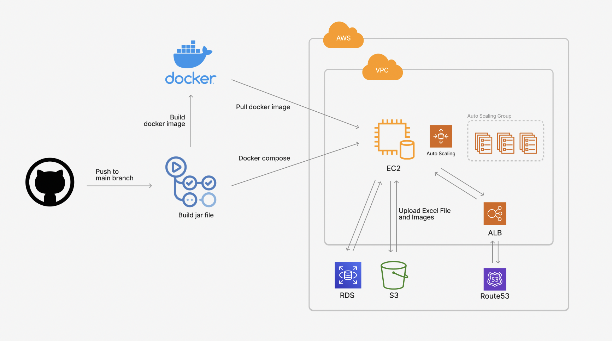

 
 
 

 
 

 

`블루키뮤직` 음악 제작사와 계약 아티스트 간의 정산 세부 내역 및 현황을 투명하게 공개하고, 
 
매출 추이 등의 통계 지표를 볼 수 있는 정산 플랫폼 사이트입니다.

 

## Architecture
### Infra
- `EC2` t2.micro instance
- `Docker container`
  - Production Server
  - Dev Server
  - Dev Server MySQL
  

