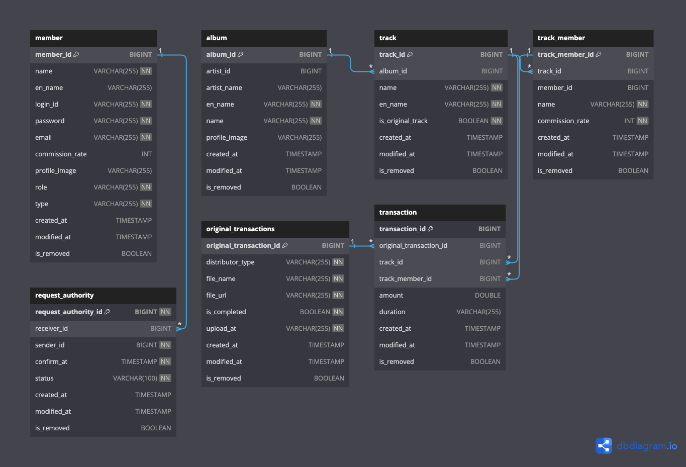

 
 

 

`블루키뮤직` 음악 제작사와 계약 아티스트 간의 정산 세부 내역 및 현황을 투명하게 공개하고,
 
매출 추이 등의 통계 지표를 볼 수 있는 정산 플랫폼 사이트입니다.

 

> <h3> Development Emphasis </h3> 

> In the development of the service, I have placed a strong emphasis on 'security' and the 'separation' of the testing environment. It is crucial to ensure that the data delivered to artists is 'accurately calculated', given the importance of this aspect.

 

# Useful Links
[🎖 **View Production Site**🎖](https://bluekeyinsight.net)  

# Contributors

<table>
  <tr>
    <td align="center"><a href="https://github.com/eunbi9n"> <b>김은비</b></a> Backend Developer</td>
        <td align="center"><a href="https://github.com/kim-raon"> <b>김도완</b></a> Backend Developer</td>
        <td align="center"><a href="https://github.com/oereo"> <b>인세훈</b></a> Backend Developer</td>
  </tr>
</table>

 

# Architecture
## ERD

## Infra

### Flow

### AWS

- EC2
    - T2.micro
    - Amazon Linux 2023
    - `Docker container` 3개 가동
        - Production Server
        - Dev Server
        - Dev Server MySQL
- Route53
    - ALB 등록 및 name server를 Front 프리티어 계정의 Route53에 등록
- S3
    - Profile Image bucket
    - Excel File bucket
- RDS
    - Production server MySQL

### Docker & Github actions

- `target branch`가 `main branch`인 경우 Production Server image build 및 EC2에서 docker container (production server) 가동
- `target branch`가 `develop branch`인 경우 Develop Server image build 및 EC2에서 docker container (dev server, DB) 가동
- `Github actions`를 통해서 자동화 배포

 

## Server

### Flow

### Spring

- <b> 정산 내역 엑셀파일 업로드 </b>

    - 엑셀파일에 대한 Validation
    - Valid한 엑셀파일에 대해 DB에 Migration

- <b> Quartz </b>

    - 아티스트에게 정산 완료 알림 메일 발송

- <b> Batch </b>

    - `optional` 추후 반영 예정
    - 데이터의 양이 많아질 경우, Batch를 통해 데이터 migration
    - 주기적으로 데이터를 삭제해야 하는 경우 Batch 사용

- <b> Transaction Processor </b>

    - Dashboard에서 사용되는 데이터를 포맷에 맞게 가공
    - `Revenue`, `NetIncome`, `Settlement` 값에 대한 계산

- <b> Security </b>

    - 관리자와 아티스트에 대한 권한 부여
    - `JWT`에 대한 validation check 및 exception 반환

### Cache Layer

- `optional` 추후 반영 예정

### Database Layer

- `Transaction` table의 경우 Indexing 적용
- `Logging` table은 추후 반영 예정

 

## Collaboration

### Sentry & Slack

- 500 Error 발생 시 Sentry capture 로직 실행
- `Slack Webhooks`를 통해서 sentry link와 에러에 대한 사항을 bot을 통해 메시지 생성 및 알림

 

# License
`BPS-BE` is Open Source software released under the [MIT License](https://github.com/Bluekey-Payment-System/BPS-BE/blob/develop/LICENSE).

